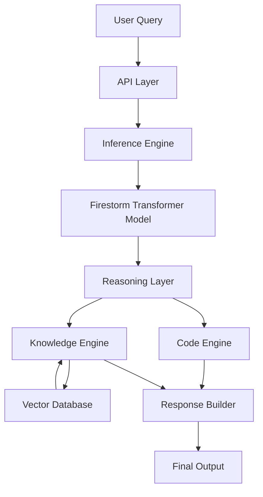

# System Architecture — Impulse Intelligent Model (IIMo)

The **IIMo system** is designed as a **modular, hybrid AI pipeline** composed of multiple interacting subsystems that enable reasoning, retrieval, and real-time inference.

---

## High-Level Architecture

```
+----------------------+
|     User Query       |
+----------+-----------+
           |
           v
+----------------------+
|      API Layer       |
+----------+-----------+
           |
           v
+----------------------+
|  Inference Engine    |
+----------+-----------+
           |
           v
+-------------------------------+
| Firestorm Transformer Model   |
+----------+--------------------+
           |
           v
+----------------------+
|   Reasoning Layer    |
+----------+-----------+
           |
     +-----+------+
     |            |
     v            v
+---------+   +------------------+
| Code    |   | Knowledge Engine |
| Engine  |   | (Retrieval)      |
+----+----+   +--------+---------+
     |                 |
     v                 v
Code Output     Retrieval Context
     \                 /
      \               /
       +------v------+
       | Response    |
       | Builder     |
       +------+
              |
              v
         Final Output
```

---

## System Components

### 1. API Layer

Provides external access to the system through REST endpoints.

**Responsibilities:**
- Request validation  
- Input preprocessing  
- Response formatting  

---

### 2. Inference Engine

Manages model execution and orchestration.

**Responsibilities:**
- Tokenization  
- Model forward pass  
- Decoding predictions  

---

### 3. IIMo (ugonuel-impulse-titan-1)

The core neural model responsible for reasoning and generation.

**Architecture Components:**
- Token embeddings  
- Transformer encoder layers  
- Prediction head  

---

### 4. Retrieval-Augmented Knowledge Module

Enables dynamic access to external knowledge.

**Components:**
- Embedding generator  
- Vector database (Qdrant)  
- Similarity search engine  

---

### 5. Reasoning Layer

Processes and structures outputs from the model.

**Responsibilities:**
- Multi-step reasoning chain generation  
- Task decomposition  
- Response synthesis  

---

## Data Flow

```
1. User submits query
2. API Layer receives request
3. Input forwarded to Inference Engine
4. Transformer Model performs reasoning
5. Retrieval Module augments with context
6. Reasoning Layer structures response
7. Response Builder assembles output
8. Final result returned to user
```

---

## Deployment Architecture

```
+----------------------+
|       Client         |
+----------+-----------+
           |
           v
+----------------------+
|    FastAPI Server    |
+----------+-----------+
           |
           v
+----------------------+
|  Inference Engine    |
+----------+-----------+
           |
           v
+----------------------+
|  Firestorm Model     |
+----------+-----------+
           |
           v
+----------------------+
|  Vector Database     |
|     (Qdrant)         |
+----------------------+
```

---

## Hybrid AI Architecture (Core Design)

```
             +----------------------+
             |     User Query       |
             +----------+-----------+
                        |
        +---------------+----------------+
        |                                |
        v                                v
+-------------------+         +------------------------+
| Neural Reasoning  |         | Retrieval System       |
| (Transformer)     |         | (Vector Search)        |
+---------+---------+         +-----------+------------+
          |                               |
          +---------------+---------------+
                          |
                          v
               +----------------------+
               | Fusion Layer         |
               | (Reasoning + Context)|
               +----------+-----------+
                          |
                          v
               +----------------------+
               | Final Response       |
               +----------------------+
```

---

## Exportable Diagram (Mermaid)



---

## Architectural Strengths

- **Modular Design** → Each subsystem can evolve independently  
- **Hybrid Intelligence** → Combines reasoning + retrieval  
- **Scalable Pipeline** → Supports future expansion (agents, RL, tools)  
- **Production-Ready** → API-first architecture for real-world use  

---

## Future Extensions

```
+----------------------+
| Autonomous Agents    |
+----------+-----------+
           |
+----------------------+
| Tool Calling System  |
+----------+-----------+
           |
+----------------------+
| Long-Term Memory     |
+----------+-----------+
           |
+----------------------+
| Self-Reflection Loop |
+----------------------+
```

---

## Summary

The **IIMo architecture** is designed to bridge the gap between:

- Static language models  
- Dynamic knowledge systems  
- Real-world AI applications  

By combining **modularity, hybrid intelligence, and real-time inference**, IIMo provides a strong foundation for building next-generation AI systems.