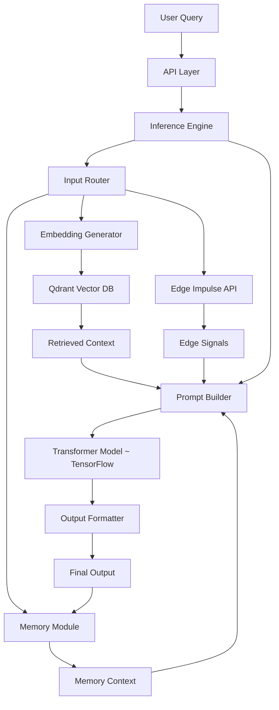

# System Architecture — Impulse Intelligent Model (IIMo)

The **IIMo system** is a **modular, hybrid AI architecture** that combines:

- Transformer-based reasoning (TensorFlow)
- Retrieval-Augmented Generation (RAG)
- Long-term memory
- Edge AI (Edge Impulse)

The system is designed for **real-time, context-aware, and extensible AI inference**.

---

## High-Level Architecture

```
+----------------------+
|     User Query       |
+----------+-----------+
           |
           v
+----------------------+
|      API Layer       |
+----------+-----------+
           |
           v
+----------------------+
|   Inference Engine   |
|   (Orchestrator)     |
+----------+-----------+
           |
           v
+------------------------------+
|        Input Router          |
| (Task Classification Layer)  |
+-----+-----------+------------+
      |           |            
      v           v            
+-----------+   +----------------------+
| Retrieval |   | Edge AI Module       |
| (RAG)     |   | (Edge Impulse)       |
+-----+-----+   +----------+-----------+
      |                    |
      v                    v
+--------------------------------------+
|        Long-Term Memory Module        |
| (Context Persistence & Recall)        |
+------------------+-------------------+
                   |
                   v
+--------------------------------------+
|         Prompt Builder               |
| (Instruction + Context + Memory)     |
+------------------+-------------------+
                   |
                   v
+--------------------------------------+
|  IIMo Transformer Model              |
|  (TensorFlow - ugonuel-impulse-titan-1) |
+------------------+-------------------+
                   |
                   v
+----------------------+
|   Output Formatter   |
+----------+-----------+
           |
           v
        Final Output
```

---

## System Components

### 1. API Layer

Provides external access via REST (FastAPI).

**Responsibilities:**
- Request validation  
- Input preprocessing  
- Response serialization  

---

### 2. Inference Engine (Orchestrator)

The **central brain of the system**, coordinating all modules.

**Responsibilities:**
- Pipeline orchestration  
- Routing decisions  
- Module coordination  
- Response aggregation  

---

### 3. Input Router (Task Classification Layer)

Determines how a request should be processed.

**Responsibilities:**
- Classify input type:
  - NLP reasoning → Transformer  
  - Knowledge query → Retrieval  
  - Contextual query → Memory  
  - Audio/sensor input → Edge Impulse  
- Route to appropriate modules  

---

### 4. IIMo Transformer Model (ugonuel-impulse-titan-1)

Core reasoning engine built with **TensorFlow/Keras**.

**Capabilities:**
- Natural language understanding  
- Multi-step reasoning  
- Code generation  

**Architecture Components:**
- Token embeddings  
- Multi-head attention layers  
- Feed-forward networks  
- Output prediction head  

---

### 5. Retrieval Module (RAG)

Provides dynamic knowledge access using vector search.

**Components:**
- Embedding generator  
- Vector database (Qdrant)  
- Similarity search engine  

**Responsibilities:**
- Convert query → embeddings  
- Retrieve relevant documents  
- Supply context to model  

---

### 6. Long-Term Memory Module (Core Feature)

Maintains persistent user/system context.

**Components:**
- Memory store (vector + structured)  
- Context retriever  
- Memory updater  

**Responsibilities:**
- Store past interactions  
- Retrieve relevant historical context  
- Improve personalization and continuity  

---

### 7. Edge AI Module (Edge Impulse Integration)

Handles **real-time edge intelligence tasks**.

**Components:**
- Edge client (API integration)  
- Inference handler  
- Edge router  

**Responsibilities:**
- Process audio, sensor, or real-time signals  
- Perform classification using Edge Impulse models  
- Feed results into the reasoning pipeline  

**Examples:**
- Voice-triggered commands  
- Sensor anomaly detection  
- Real-time event classification  

---

### 8. Prompt Builder (Reasoning Input Layer)

Constructs structured model inputs.

**Input Format:**

```
Instruction: <user query>
Context: <retrieved knowledge>
Memory: <relevant past interactions>
Edge Signals: <optional edge inference>
```

**Responsibilities:**
- Merge all context sources  
- Normalize input format  
- Prepare model-ready sequences  

---

### 9. Output Formatter (Reasoning Output Layer)

Transforms raw model output into usable responses.

**Responsibilities:**
- Clean generated text  
- Ensure coherence  
- Format structured API responses  

---

## Data Flow

```
1. User submits query
2. API Layer validates request
3. Inference Engine receives input

4. Input Routing:
   - Classify request type
   - Route to:
     • Retrieval (RAG)
     • Memory
     • Edge Impulse (if applicable)

5. Retrieval Phase:
   - Generate embeddings
   - Query vector database (Qdrant)
   - Retrieve relevant context

6. Memory Phase:
   - Retrieve relevant past context

7. Edge Processing (if needed):
   - Run Edge Impulse inference
   - Return structured signals

8. Prompt Construction:
   - Combine instruction + context + memory + edge signals

9. Model Execution:
   - Tokenization
   - Transformer inference (TensorFlow)
   - Output decoding

10. Output Processing:
   - Format response

11. Memory Update:
   - Store interaction for future use

12. Return final response
```

---

## Deployment Architecture



---

## Architectural Strengths

- **Modular Design**  
  Independent, replaceable system components  

- **Hybrid Intelligence**  
  Combines neural reasoning, retrieval, memory, and edge AI  

- **Real-Time Capabilities**  
  Supports live inference and external integrations  

- **Scalable & Extensible**  
  Easily supports future AI capabilities  

- **Edge + Cloud Synergy**  
  Integrates lightweight edge intelligence with deep reasoning  

---

## Future Extensions

```
+----------------------+
| Advanced Reasoning   |
+----------+-----------+
           |
+----------------------+
| Reinforcement Learning|
+----------+-----------+
           |
+----------------------+
| Self-Improvement Loop|
+----------------------+
```

---

## Summary

The **IIMo architecture** represents a next-generation AI system that integrates:

- Transformer-based reasoning (TensorFlow)  
- Retrieval-augmented knowledge systems (Qdrant)  
- Persistent long-term memory  
- Edge AI capabilities (Edge Impulse)  

This results in a system that is:

- Context-aware  
- Scalable  
- Modular  
- Production-ready and capable of evolving into a **general-purpose intelligent system**.