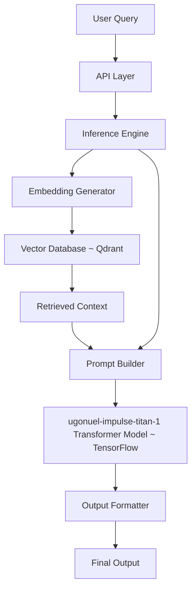

# System Architecture — Impulse Intelligent Model (IIMo)

The **IIMo system** is designed as a **modular, retrieval-augmented AI pipeline** that integrates transformer-based reasoning with external knowledge retrieval for real-time inference.

---

## High-Level Architecture

```
+----------------------+
|     User Query       |
+----------+-----------+
           |
           v
+----------------------+
|      API Layer       |
+----------+-----------+
           |
           v
+----------------------+
|  Inference Engine    |
+----------+-----------+
           |
           v
+----------------------+
| Retrieval Module     |
| (Embeddings + DB)    |
+----------+-----------+
           |
           v
+----------------------+
| Prompt Builder       |
| (Instruction+Context)|
+----------+-----------+
           |
           v
+-------------------------------+
| IIMo Transformer Model        |
| (TensorFlow)                  |
+----------+--------------------+
           |
           v
+----------------------+
| Output Formatter     |
+----------+-----------+
           |
           v
        Final Output
```

---

## System Components

### 1. API Layer

Provides external access to the system through REST endpoints.

**Responsibilities:**
- Request validation  
- Input preprocessing  
- Response formatting  

---

### 2. Inference Engine

Central orchestration layer responsible for executing the full AI pipeline.

**Responsibilities:**
- Input handling  
- Retrieval orchestration  
- Prompt construction  
- Tokenization  
- Model execution  
- Output decoding  

---

### 3. IIMo Transformer Model (ugonuel-impulse-titan-1)

The core neural model built using **TensorFlow/Keras**, responsible for reasoning and generation.

**Architecture Components:**
- Token embeddings  
- Transformer layers (attention mechanisms)  
- Prediction head  

---

### 4. Retrieval Module

Enables dynamic knowledge augmentation using a vector database.

**Components:**
- Embedding generator  
- Vector database (**Qdrant**)  
- Similarity search  

**Responsibilities:**
- Convert query into embeddings  
- Perform nearest-neighbor search  
- Return relevant contextual documents  

---

### 5. Prompt Builder (Reasoning Input Layer)

Constructs structured inputs for the model to enable effective reasoning.

**Input Format:**

```
Instruction: <user query>
Context: <retrieved knowledge>
```

**Responsibilities:**
- Combine user query with retrieved context  
- Enforce consistent input structure  
- Prepare model-ready sequences  

---

### 6. Output Formatter (Reasoning Output Layer)

Processes raw model outputs into structured responses.

**Responsibilities:**
- Clean and format generated text  
- Ensure coherence and readability  
- Structure responses for API output  

---

## Data Flow

```
1. User submits query
2. API Layer receives and validates request
3. Inference Engine processes input

4. Retrieval Phase:
   - Generate embedding from query
   - Query vector database (Qdrant)
   - Retrieve relevant context

5. Prompt Construction:
   - Combine instruction and retrieved context

6. Model Execution:
   - Tokenize input
   - Run TensorFlow transformer model
   - Decode output tokens

7. Output Processing:
   - Format response

8. Final response returned to user
```

---

## Deployment Architecture



---

## Architectural Strengths

- **Modular Design**  
  Each subsystem is independently maintainable and extensible  

- **Retrieval-Augmented Intelligence**  
  Combines learned knowledge with dynamic external context  

- **Consistent Data Flow**  
  Clear separation between retrieval, reasoning, and generation  

- **Production-Ready Pipeline**  
  API-first architecture with real-time inference capability  

---

## Future Extensions

The architecture is designed to support future enhancements:

```
+----------------------+
| Advanced Reasoning   |
+----------+-----------+
           |
+----------------------+
| Reinforcement Learning|
+----------+-----------+
           |
+----------------------+
| Long-Context Memory  |
+----------+-----------+
           |
+----------------------+
| Self-Improvement Loop|
+----------------------+
```

---

## Summary

The **IIMo architecture** provides a structured approach to building modern AI systems by combining:

- Transformer-based reasoning (TensorFlow)  
- Retrieval-augmented knowledge systems (RAG)
- Modular inference pipelines  

This design ensures that the system is:

- Scalable  
- Maintainable  
- Ready for real-world AI deployment  